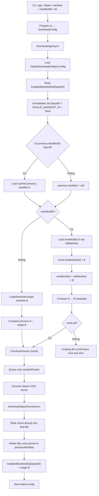
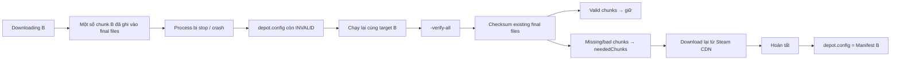

# Kiểm toán hardcode, network, manifest và cơ chế resume của SteamAutoCracks/DepotDownloaderMod

## Tóm tắt điều hành

Tôi đã ưu tiên kiểm tra nhánh `master` hiện tại của `SteamAutoCracks/DepotDownloaderMod` và pin các vị trí quan trọng vào commit hiện tại mà GitHub API trả về là `e12af5cab72a6ccd87b445b0a44e3b78c6188870`, commit ngày **1/9/2026**, message `Update endpoint`. Commit này thực sự sửa một endpoint/source name trong `Scripts/storage_depotdownloadermod.py`, nên việc dùng URL pin theo commit thay vì `master` là quan trọng cho audit. fileciteturn29file0L2-L2

Kết luận chính:

1. **Core C# của DepotDownloaderMod có khá nhiều hardcode**, nhưng chủ yếu là sentinel/default/path: `INVALID_MANIFEST_ID = ulong.MaxValue`, `DEFAULT_BRANCH = "public"`, `DEFAULT_DOWNLOAD_DIR = "depots"`, `.DepotDownloader`, `staging`, `account.config`, default `MaxDownloads = 8`, default Steam LoginID `0x534B32`, và một anonymous subscription/package ID `17906`. Các AppID/DepotID/ManifestID game cụ thể nhìn chung **không bị hardcode để điều khiển downloader**; chúng đến từ CLI/PICS. README có các ID ví dụ như `730`, `731`, `7617088375292372759`, nhưng đó là example, không phải runtime constant. citeturn6view0turn9search2

2. Tôi **không thấy Steam CDN hostname cố định trong core C#**. Core gọi SteamKit2 để lấy server qua `GetServersForSteamPipe()`, rồi dùng `server.Host`; manifest/chunk được tải qua `DownloadManifestAsync()` và `DownloadDepotChunkAsync()`. Các request PICS, manifest request code, CDN auth token cũng đi qua SteamKit2. Nói cách khác, Steam CDN endpoint là **runtime-discovered**, không phải kiểu hardcode `*.steamcontent.com` trong `ContentDownloader.cs`. Điều này tương tự upstream SteamRE. citeturn5search3turn9search2

3. `.DepotDownloader/depot.config` rất quan trọng: downloader đọc `InstalledManifestIDs`, rồi **ngay trước khi xử lý depot nó ghi ManifestID thành `INVALID_MANIFEST_ID` và save**. Chỉ khi depot hoàn tất mới ghi target ManifestID thật trở lại. Đây chính là cơ chế recovery khi process chết giữa chừng; upstream SteamRE cũng có cùng thiết kế và comment nói rõ mục đích là buộc lần chạy sau thực hiện tương đương `verify-all`. citeturn5search3

4. Tuy nhiên, **fork này có một điểm rất đáng chú ý trong `-manifestfile`**: sau khi đã đọc manifest cũ từ `depot.config`, nó lại gán `lastManifestId = depot.ManifestId` và load `Config.ManifestFile` vào chính biến `oldManifest`; sau đó vì ID khớp target nên `newManifest = oldManifest`. Tức trong workflow `-manifestfile`, target manifest B **đè vai trò của previous manifest A**. Đây là khác biệt có ảnh hưởng trực tiếp tới version switching và resume. fileciteturn30file0L2-L2

5. Hệ quả quan trọng: với `-manifestfile`, **`-verify-all` gần như bắt buộc nếu muốn resume đáng tin cậy**. Nếu bỏ `-verify-all`, một file đang tồn tại có thể được so B-với-B về metadata và bị coi là hợp lệ mà không checksum dữ liệu thực trên disk. Helper script của repo lại hardcode `DEPOTDOWNLOADER_ARGS = "-max-downloads 256 -verify-all"`, vô tình hoặc có chủ ý tránh được phần lớn vấn đề này. citeturn10view1 fileciteturn27file0L2-L2

6. **Không có pause/resume API thật sự** trong CLI hiện tại. Tìm `pause`, `resume`, `Console.CancelKeyPress` và `ProcessExit` trong `Program.cs` đều không có kết quả; có `OperationCanceledException`, `CancellationTokenSource` và cancellation nội bộ, nhưng chúng phục vụ error/cancellation flow chứ chưa có user-facing pause command. citeturn10view2turn10view3turn11view0turn11view1turn11view2

7. Dù vậy, **“stop process rồi chạy lại” có thể tiếp tục ở cấp chunk**: chunk hợp lệ đang nằm trong file đích được checksum và chỉ `neededChunks` mới được enqueue lại. Đáng chú ý, `staging` **không phải cache resume bền vững**: nếu file staging còn sót từ lần chạy trước, code xóa nó trước khi xử lý file. Phần dữ liệu có ích để resume nằm chủ yếu trong **file đích đã ghi dở**, manifest và `.DepotDownloader/depot.config`, không phải staging. fileciteturn31file0L2-L2 fileciteturn32file0L2-L2

8. Trong khi core C# tương đối sạch về endpoint literal, `Scripts/storage_depotdownloadermod.py` thì ngược lại: có rất nhiều **URL/API/CDN mirror hardcoded**, một `httpx.AsyncClient(..., verify=False)`, ManifestHub endpoint, GitHub API, Kugou geolocation endpoint, Gitee, PrintedWaste, gdata, cysaw và nhiều GitHub raw mirrors; ngoài ra còn có crypto keys cố định và một Bearer token literal. Đây là phần có surface hardcode/network lớn nhất repo. citeturn5search0turn5search4

## Phạm vi kiểm tra và các literal đã tìm

Repo chính hiện tự mô tả là fork của `jagotu/DepotDownloader`, sử dụng SteamKit2, hỗ trợ `-depotkeys`, `-manifestfile`, App/Package token và .NET 9. README còn ghi rõ rằng fork này “require a manifest file” do vấn đề `GetManifestRequestCode Verification`. citeturn6view0

Snapshot tôi dùng cho các direct code link bên dưới:

```text
Repo:   SteamAutoCracks/DepotDownloaderMod
Branch: master
Commit: e12af5cab72a6ccd87b445b0a44e3b78c6188870
Date:   2026-09-01
```

Commit hiện tại được GitHub API ghi nhận là `Update endpoint`. fileciteturn29file0L2-L2

Các literal/API tôi kiểm tra trực tiếp gồm:

```text
INVALID_MANIFEST_ID
INVALID_DEPOT_ID
INVALID_APP_ID
manifestfile
manifest
depot.config
.DepotDownloader
staging
verify-all
verify_all
validate
ValidateSteam3FileChecksums
CancellationTokenSource
OperationCanceledException
CancelKeyPress
ProcessExit
pause
resume
GetServersForSteamPipe
GetManifestRequestCode
GetCDNAuthToken
DownloadManifestAsync
DownloadDepotChunkAsync
GetStreamAsync
http://
https://
```

Ở `Program.cs`, tìm trực tiếp `CancelKeyPress`, `ProcessExit`, `pause`, `resume` đều không có match; `OperationCanceledException` thì có ở các download branches. citeturn10view2turn10view3turn11view0turn11view1turn11view2

## Bảng phát hiện chi tiết

Các link dưới đây được pin theo commit để line number không bị trôi khi `master` thay đổi.

| Repo + file | Dòng | Literal / đoạn code ngắn | Phân tích | Direct GitHub |
|---|---:|---|---|---|
| `SteamAutoCracks/DepotDownloaderMod` — `DepotDownloader/ContentDownloader.cs` | 24–36 | `INVALID_*`, `"public"`, `"depots"`, `".DepotDownloader"`, `"staging"` | Nhóm hardcode nền tảng. `INVALID_MANIFEST_ID` là `ulong.MaxValue`; config dir và staging dir cố định tương đối theo install directory. Upstream SteamRE hiện cũng có cùng nhóm constants. citeturn9search2 | [ContentDownloader.cs#L24-L36](https://github.com/SteamAutoCracks/DepotDownloaderMod/blob/e12af5cab72a6ccd87b445b0a44e3b78c6188870/DepotDownloader/ContentDownloader.cs#L24-L36) |
| `SteamAutoCracks/...` — `ContentDownloader.cs` | 50–77 | `CreateDirectories(...)` | Nếu không có `-dir`, layout mặc định là `depots/<depotId>/<buildVersion>/`; trong cả custom dir lẫn default dir đều tạo `.DepotDownloader` và `.DepotDownloader/staging`. | [ContentDownloader.cs#L50-L77](https://github.com/SteamAutoCracks/DepotDownloaderMod/blob/e12af5cab72a6ccd87b445b0a44e3b78c6188870/DepotDownloader/ContentDownloader.cs#L50-L77) |
| `SteamAutoCracks/...` — `ContentDownloader.cs` | 109–120 | `licenseQuery = [17906]` | **Hardcoded numeric ID có tác động runtime.** Đây là package/subscription ID dùng trong nhánh anonymous của `AccountHasAccess`; không phải ManifestID hay DepotID game target. fileciteturn33file0L2-L2 | [ContentDownloader.cs#L109-L120](https://github.com/SteamAutoCracks/DepotDownloaderMod/blob/e12af5cab72a6ccd87b445b0a44e3b78c6188870/DepotDownloader/ContentDownloader.cs#L109-L120) |
| `SteamAutoCracks/...` — `ContentDownloader.cs` | khoảng 180 | `111710`, `346680` | Có numeric IDs trong comment về shared-depot test cases. Đây chỉ là **comment/test reference**, không điều khiển target download. | [ContentDownloader.cs](https://github.com/SteamAutoCracks/DepotDownloaderMod/blob/e12af5cab72a6ccd87b445b0a44e3b78c6188870/DepotDownloader/ContentDownloader.cs) |
| `SteamAutoCracks/...` — `ContentDownloader.cs` | 295–313 | `0x534B32 // "SK2"` | Default Steam `LoginID` hardcoded nếu user không truyền `-loginid`. fileciteturn34file0L2-L2 | [ContentDownloader.cs#L295-L313](https://github.com/SteamAutoCracks/DepotDownloaderMod/blob/e12af5cab72a6ccd87b445b0a44e3b78c6188870/DepotDownloader/ContentDownloader.cs#L295-L313) |
| `SteamAutoCracks/...` — `Program.cs` | khoảng 44–50 | `"account.config"` | Account settings được load từ một filename literal tương đối với working directory. fileciteturn35file0L2-L2 | [Program.cs#L44-L50](https://github.com/SteamAutoCracks/DepotDownloaderMod/blob/e12af5cab72a6ccd87b445b0a44e3b78c6188870/DepotDownloader/Program.cs#L44-L50) |
| `SteamAutoCracks/...` — `Program.cs` | 170–193 | `-verify-all`, `-verify_all`, `-validate`, `-manifestfile` | Ba tên flag đều bật `VerifyAll`; `-manifestfile` được parse riêng thành `UseManifestFile` và `ManifestFile`. Web source xác nhận các assignment này. citeturn10view0turn10view1 | [Program.cs#L170-L193](https://github.com/SteamAutoCracks/DepotDownloaderMod/blob/e12af5cab72a6ccd87b445b0a44e3b78c6188870/DepotDownloader/Program.cs#L170-L193) |
| `SteamAutoCracks/...` — `Program.cs` | 183–190 | `25`, rồi default `8` | Có một điểm đáng kiểm tra: Lancache branch đặt `MaxDownloads = 25` nếu user không truyền flag, nhưng ngay sau đó code lại gọi `GetParameter(..., 8)`. Theo control flow hiện tại, giá trị 25 có vẻ bị default 8 ghi đè. Đây là một **inference từ source**, đáng sửa riêng. citeturn10view0turn10view1 | [Program.cs#L183-L190](https://github.com/SteamAutoCracks/DepotDownloaderMod/blob/e12af5cab72a6ccd87b445b0a44e3b78c6188870/DepotDownloader/Program.cs#L183-L190) |
| `SteamAutoCracks/...` — `ContentDownloader.cs` | khoảng 406–421 | `"depot.config"` | `DownloadAppAsync` tạo config dir rồi gọi `DepotConfigStore.LoadFromFile(<config>/.DepotDownloader/depot.config)`. fileciteturn20file0L2-L2 | [ContentDownloader.cs#L406-L421](https://github.com/SteamAutoCracks/DepotDownloaderMod/blob/e12af5cab72a6ccd87b445b0a44e3b78c6188870/DepotDownloader/ContentDownloader.cs#L406-L421) |
| `SteamAutoCracks/...` — `DepotDownloader/DepotConfigStore.cs` | 12–58 | `InstalledManifestIDs` | `depot.config` chứa `Dictionary<uint, ulong>`; file được Deflate-decompress + protobuf-deserialize khi load và Deflate + protobuf-serialize khi save. Nó **không phải text config**. fileciteturn6file0L2-L2 | [DepotConfigStore.cs#L12-L58](https://github.com/SteamAutoCracks/DepotDownloaderMod/blob/e12af5cab72a6ccd87b445b0a44e3b78c6188870/DepotDownloader/DepotConfigStore.cs#L12-L58) |
| `SteamAutoCracks/...` — `ContentDownloader.cs` | 725–731 | `InstalledManifestIDs[...] = INVALID_MANIFEST_ID` | Trước khi tải, state hiện tại bị đánh dấu INVALID và `Save()` ngay. Nếu process chết sau đây, lần chạy kế tiếp biết lần trước chưa hoàn tất. Upstream SteamRE có cùng logic/comment. citeturn5search3turn9search2 | [ContentDownloader.cs#L725-L731](https://github.com/SteamAutoCracks/DepotDownloaderMod/blob/e12af5cab72a6ccd87b445b0a44e3b78c6188870/DepotDownloader/ContentDownloader.cs#L725-L731) |
| `SteamAutoCracks/...` — `ContentDownloader.cs` | 733–738 | load previous cached manifest | Nếu state cũ hợp lệ, code load manifest ID trước đó từ `configDir`. Đây là đường A → B “đúng chuẩn” trước khi `-manifestfile` can thiệp. fileciteturn30file0L2-L2 | [ContentDownloader.cs#L733-L738](https://github.com/SteamAutoCracks/DepotDownloaderMod/blob/e12af5cab72a6ccd87b445b0a44e3b78c6188870/DepotDownloader/ContentDownloader.cs#L733-L738) |
| `SteamAutoCracks/...` — `ContentDownloader.cs` | 740–752 | `lastManifestId = depot.ManifestId`; load `Config.ManifestFile` into `oldManifest` | **Finding quan trọng nhất của fork.** `-manifestfile` ghi đè previous manifest đã vừa load. Target B trở thành `oldManifest`. fileciteturn30file0L2-L2 | [ContentDownloader.cs#L740-L752](https://github.com/SteamAutoCracks/DepotDownloaderMod/blob/e12af5cab72a6ccd87b445b0a44e3b78c6188870/DepotDownloader/ContentDownloader.cs#L740-L752) |
| `SteamAutoCracks/...` — `ContentDownloader.cs` | 754–759 | `newManifest = oldManifest` | Vì `lastManifestId` vừa bị ép thành target ID, branch kế tiếp nhận manifest file làm luôn `newManifest`. Đây là lý do `previousManifest` bên dưới thực tế có thể là B thay vì A. fileciteturn30file0L2-L2 | [ContentDownloader.cs#L754-L759](https://github.com/SteamAutoCracks/DepotDownloaderMod/blob/e12af5cab72a6ccd87b445b0a44e3b78c6188870/DepotDownloader/ContentDownloader.cs#L754-L759) |
| `SteamAutoCracks/...` — `ContentDownloader.cs` | 777–813 | `GetDepotManifestRequestCodeAsync(...)`, TTL 5 phút | Khi phải tải manifest online, code yêu cầu manifest request code và cache nó với thời gian hardcode `TimeSpan.FromMinutes(5)`. Host vẫn chưa hardcode ở đây. fileciteturn30file0L2-L2 | [ContentDownloader.cs#L777-L813](https://github.com/SteamAutoCracks/DepotDownloaderMod/blob/e12af5cab72a6ccd87b445b0a44e3b78c6188870/DepotDownloader/ContentDownloader.cs#L777-L813) |
| `SteamAutoCracks/...` — `ContentDownloader.cs` | 814–829 | `DownloadManifestAsync(...)` | Explicit network operation tới Steam CDN qua SteamKit2. `connection` đến từ CDN pool; không phải hostname literal. fileciteturn30file0L2-L2 | [ContentDownloader.cs#L814-L829](https://github.com/SteamAutoCracks/DepotDownloaderMod/blob/e12af5cab72a6ccd87b445b0a44e3b78c6188870/DepotDownloader/ContentDownloader.cs#L814-L829) |
| `SteamAutoCracks/...` — `CDNClientPool.cs` | khoảng 29–62 | `GetServersForSteamPipe()` | Steam content servers được lấy động; lọc `Type == "SteamCache" || "CDN"`, xét `AllowedAppIds`, `WeightedLoad`, rồi dùng `server.Host`. Không thấy fixed Steam CDN hostname ở đây. fileciteturn12file0L2-L2 | [CDNClientPool.cs#L29-L62](https://github.com/SteamAutoCracks/DepotDownloaderMod/blob/e12af5cab72a6ccd87b445b0a44e3b78c6188870/DepotDownloader/CDNClientPool.cs#L29-L62) |
| `SteamAutoCracks/...` — `Steam3Session.cs` | khoảng 130–215 | `PICSGetAccessTokens`, `PICSGetProductInfo` | Explicit Steam network/service calls nhưng endpoint URL nằm trong SteamKit2/protocol configuration, không literal trong fork. fileciteturn14file0L2-L2 | [Steam3Session.cs#L130-L215](https://github.com/SteamAutoCracks/DepotDownloaderMod/blob/e12af5cab72a6ccd87b445b0a44e3b78c6188870/DepotDownloader/Steam3Session.cs#L130-L215) |
| `SteamAutoCracks/...` — `Steam3Session.cs` | khoảng 260–330 | `GetDepotDecryptionKey`, `GetManifestRequestCode`, `GetCDNAuthToken` | Ba network/service operations then chốt cho depot download. CDN auth call nhận `server.Host` động. fileciteturn15file0L2-L2 | [Steam3Session.cs#L260-L330](https://github.com/SteamAutoCracks/DepotDownloaderMod/blob/e12af5cab72a6ccd87b445b0a44e3b78c6188870/DepotDownloader/Steam3Session.cs#L260-L330) |
| `SteamAutoCracks/...` — `HttpClientFactory.cs` | 13–49 | IPv4 `ConnectCallback`, User-Agent | HttpClient ép IPv4 và connect đến `context.DnsEndPoint`; hostname đến từ request runtime. Không có Steam hostname cố định. Chỉ có URL GitHub dotnet issue trong **comment**, không phải endpoint runtime. fileciteturn13file0L2-L2 | [HttpClientFactory.cs#L13-L49](https://github.com/SteamAutoCracks/DepotDownloaderMod/blob/e12af5cab72a6ccd87b445b0a44e3b78c6188870/DepotDownloader/HttpClientFactory.cs#L13-L49) |
| `SteamAutoCracks/...` — `ContentDownloader.cs` | khoảng 375–404 | `GetStreamAsync(url)` | Pubfile/UGC có thể dùng một URL được Steam trả về và tải bằng HttpClient vào staging; đây là explicit arbitrary-runtime URL request, nhưng URL **không hardcode** trong C#. fileciteturn20file0L2-L2 | [ContentDownloader.cs#L375-L404](https://github.com/SteamAutoCracks/DepotDownloaderMod/blob/e12af5cab72a6ccd87b445b0a44e3b78c6188870/DepotDownloader/ContentDownloader.cs#L375-L404) |
| `SteamAutoCracks/...` — `ContentDownloader.cs` | 891–918 | target + staging paths | Với mỗi manifest file, nó chuẩn bị cả final path và staging path. fileciteturn31file0L2-L2 | [ContentDownloader.cs#L891-L918](https://github.com/SteamAutoCracks/DepotDownloaderMod/blob/e12af5cab72a6ccd87b445b0a44e3b78c6188870/DepotDownloader/ContentDownloader.cs#L891-L918) |
| `SteamAutoCracks/...` — `ContentDownloader.cs` | khoảng 961–987 | delete old-only files; save target ID | Sau download thành công, file chỉ có trong previous manifest sẽ bị xóa; sau đó `InstalledManifestIDs[depot] = targetManifestId` và save. Nhưng khả năng xóa A-only file bị ảnh hưởng nếu `-manifestfile` đã làm `previousManifest` thành B. fileciteturn31file0L2-L2 | [ContentDownloader.cs#L955-L990](https://github.com/SteamAutoCracks/DepotDownloaderMod/blob/e12af5cab72a6ccd87b445b0a44e3b78c6188870/DepotDownloader/ContentDownloader.cs#L955-L990) |
| `SteamAutoCracks/...` — `ContentDownloader.cs` | khoảng 1010–1020 | leftover staging → `File.Delete` | Comment nói staging có thể còn nếu lần chạy trước exit trước cleanup; code **xóa staging leftover** trước khi bắt đầu xử lý file. Vì vậy staging không phải durable resume cache. fileciteturn31file0L2-L2 | [ContentDownloader.cs#L1005-L1022](https://github.com/SteamAutoCracks/DepotDownloaderMod/blob/e12af5cab72a6ccd87b445b0a44e3b78c6188870/DepotDownloader/ContentDownloader.cs#L1005-L1022) |
| `SteamAutoCracks/...` — `ContentDownloader.cs` | khoảng 1045–1115 | `VerifyAll`, chunk ID matching, Adler checksum | Nếu verify hoặc file hash không match, downloader tìm chunk chung theo `ChunkID`, checksum nội dung cũ bằng Adler, giữ chunk hợp lệ và đưa chunk sai vào `neededChunks`. fileciteturn31file0L2-L2 fileciteturn32file0L2-L2 | [ContentDownloader.cs#L1040-L1115](https://github.com/SteamAutoCracks/DepotDownloaderMod/blob/e12af5cab72a6ccd87b445b0a44e3b78c6188870/DepotDownloader/ContentDownloader.cs#L1040-L1115) |
| `SteamAutoCracks/...` — `ContentDownloader.cs` | khoảng 1125–1160 | `ValidateSteam3FileChecksums(...)` | Nếu không có usable previous-manifest entry, nó bắt buộc checksum file đang nằm trên disk và chỉ giữ các chunk cần tải. Đây là cơ sở của restart/resume ở upstream. fileciteturn32file0L2-L2 | [ContentDownloader.cs#L1125-L1160](https://github.com/SteamAutoCracks/DepotDownloaderMod/blob/e12af5cab72a6ccd87b445b0a44e3b78c6188870/DepotDownloader/ContentDownloader.cs#L1125-L1160) |
| `SteamAutoCracks/...` — `ContentDownloader.cs` | khoảng 1180–1250 | `DownloadDepotChunkAsync(...)` | Chỉ `neededChunks` được enqueue, rồi mỗi chunk được tải từ CDN và ghi vào đúng offset của **final file**. Đây là lý do dữ liệu đã ghi dở có thể được tái sử dụng lần sau. fileciteturn32file0L2-L2 | [ContentDownloader.cs#L1180-L1250](https://github.com/SteamAutoCracks/DepotDownloaderMod/blob/e12af5cab72a6ccd87b445b0a44e3b78c6188870/DepotDownloader/ContentDownloader.cs#L1180-L1250) |
| `SteamAutoCracks/...` — `Program.cs` | nhiều vị trí | `OperationCanceledException` | Program biết xử lý cancellation exception và shutdown Steam session trong `finally`, nhưng không có user-facing pause/resume entrypoint. citeturn10view2 | [Program.cs](https://github.com/SteamAutoCracks/DepotDownloaderMod/blob/e12af5cab72a6ccd87b445b0a44e3b78c6188870/DepotDownloader/Program.cs) |
| `SteamAutoCracks/...` — `DepotDownloaderMod.csproj` | khoảng 25–30 | `SteamKit2 3.2.0` | Chứng minh network/protocol layer của fork được delegate đáng kể sang SteamKit2 package. fileciteturn28file0L2-L2 | [DepotDownloaderMod.csproj](https://github.com/SteamAutoCracks/DepotDownloaderMod/blob/e12af5cab72a6ccd87b445b0a44e3b78c6188870/DepotDownloader/DepotDownloaderMod.csproj) |

### Hardcoded AppID, DepotID và ManifestID

Trong **runtime C# core**, tôi không thấy một game-specific ManifestID hay DepotID cố định được dùng làm target mặc định. `Program.cs` đọc `-app`, `-depot`, `-manifest`, và khi không có ManifestID thì dùng sentinel để resolve từ Steam metadata. README mô tả đúng cách này. citeturn6view0turn10view2

README có ví dụ:

```text
AppID      730
DepotID    731
ManifestID 7617088375292372759
```

nhưng đây chỉ là lệnh ví dụ tài liệu, không phải hardcode runtime. README cũng có pubfile/UGC sample IDs. citeturn6view0

Các numeric constant đáng chú ý trong runtime là `17906` ở nhánh anonymous và `0x534B32` cho default LoginID; `111710`/`346680` chỉ xuất hiện dưới dạng test-case comment. fileciteturn33file0L2-L2 fileciteturn34file0L2-L2

## Manifest, depot.config, staging và version switching

Đây là phần quan trọng nhất nếu mục tiêu của bạn là launcher có **A → B → A**, stop/resume và giữ từng BuildID.

Luồng core có thể mô tả như sau:



Đường “đánh dấu INVALID trước rồi ghi target sau khi hoàn thành” là thiết kế upstream SteamRE, không phải riêng fork; source upstream hiện vẫn chứa comment rằng việc này nhằm buộc lần chạy kế tiếp thực hiện tương đương verify-all nếu lần trước exit sớm. citeturn5search3turn9search2

### Vấn đề `-manifestfile` khi đổi version

Giả sử disk đang là A:

```text
depot.config:
Depot 123 → Manifest A
```

và bạn chạy:

```text
-target Manifest B
-manifestfile B.manifest
```

Ở đầu hàm, fork thực sự có khả năng load A:

```text
lastManifestId = A
oldManifest = load(A)
```

nhưng ngay sau đó branch `UseManifestFile` làm về mặt logic:

```text
lastManifestId = B
oldManifest = load(B.manifest)
```

rồi:

```text
newManifest = oldManifest
```

Tức previous manifest A vừa load **bị mất khỏi biến được truyền xuống phase file diff**. Đây là nhận định trực tiếp từ control flow của source hiện tại. fileciteturn30file0L2-L2

Điều này tạo ra ba tác động.

**Thứ nhất, xóa file cũ không còn chính xác.** Code có logic xóa file tồn tại trong `previousManifest` nhưng không còn trong target. Tuy nhiên nếu `previousManifest` thực tế đã bị đổi thành B, file chỉ có trong A sẽ không nằm trong danh sách previous để xóa. Vì vậy một A-only file có thể còn sót sau A → B. fileciteturn31file0L2-L2

**Thứ hai, delta reuse kém tối ưu hơn A ↔ B thật.** Nếu một chunk B đã tồn tại trong A nhưng ở offset khác, previous metadata B không mô tả vị trí chunk đó trong A. Code vì thế có thể không tận dụng được chunk relocation tốt như khi có actual previous manifest A. Đây là inference từ cách nó lấy `oldChunk.Offset` để đọc dữ liệu cũ. fileciteturn31file0L2-L2 fileciteturn32file0L2-L2

**Thứ ba, và nguy hiểm nhất, bỏ `-verify-all` có thể làm resume/version-switch sai.** `oldManifestFile` và target `file` đều đến từ manifest B, vì vậy `FileHash` của chúng đương nhiên khớp về metadata. Khi `VerifyAll == false`, nhánh checksum có thể không chạy; một final file dở dang hoặc vẫn chứa version A có nguy cơ được coi là xong. Đây là inference rất mạnh từ branch condition của source, không chỉ suy đoán UX. fileciteturn31file0L2-L2

Điều đáng chú ý là script đi kèm fork luôn sinh BAT với `-verify-all`, phù hợp với việc tránh chính vấn đề trên. fileciteturn27file0L2-L2

### `staging` thực sự làm gì

Một điểm cần sửa lại so với cách hiểu “staging = cache resume”: **không hẳn**.

Với depot files, nếu staging file còn tồn tại từ một lần chạy bị ngắt, source có comment nói rõ đó có thể là leftover của previous run, rồi **xóa nó ngay**. fileciteturn31file0L2-L2

Khi một file cần được rearrange/rebuilt, final cũ có thể được move tạm sang staging, các chunk hợp lệ được copy sang final mới, rồi staging lại bị xóa. fileciteturn32file0L2-L2

Còn chunk mới tải từ Steam CDN được ghi trực tiếp vào `fileFinalPath` tại `chunk.Offset`. Vì vậy khi kill giữa chừng, thứ có giá trị cho lần restart là **các chunk đã được ghi vào final file**, không phải một collection chunk trong staging. fileciteturn32file0L2-L2

Riêng `DownloadWebFile` cho một UGC/pubfile URL thì staging được dùng theo kiểu tải toàn stream vào staging rồi move sang final; tôi không thấy HTTP Range/resume logic ở hàm này, nên không nên coi kiểu web-file download đó là resumable giống depot chunk download. fileciteturn20file0L2-L2

## Network endpoints và hardcode ngoài core

### Steam network layer trong C#

Trong core downloader, các network operations quan trọng tôi tìm thấy là:

```text
SteamClient.Connect()
PICSGetAccessTokens()
PICSGetProductInfo()
GetDepotDecryptionKey()
GetManifestRequestCode()
GetCDNAuthToken()
GetServersForSteamPipe()
DownloadManifestAsync()
DownloadDepotChunkAsync()
PublishedFile.GetDetails()
SteamCloud.RequestUGCDetails()
HttpClient.GetStreamAsync(runtimeUrl)
```

Các call này được triển khai qua SteamKit2 handlers/CDN client. `CDNClientPool` lấy danh sách content servers từ Steam rồi dùng `server.Host`; vì vậy tôi không thấy kiểu literal `https://<Steam CDN hostname>/...` trong C# core. fileciteturn12file0L2-L2 fileciteturn14file0L2-L2 fileciteturn15file0L2-L2

Upstream SteamRE có cùng architecture và cùng constants `.DepotDownloader`, `staging`, `INVALID_MANIFEST_ID`; đây là bằng chứng phần lớn download engine vẫn xuất phát từ upstream. citeturn5search3turn9search2

### Python helper có nhiều endpoint literal hơn hẳn

`Scripts/storage_depotdownloadermod.py` là nơi audit hardcode trở nên đáng chú ý nhất.

Ngay đầu file có:

```text
httpx.AsyncClient(... verify=False)
DepotDownloadermod.exe
-max-downloads 256 -verify-all
manifesthub2.filegear-sg.me
api.manifesthub2.filegear-sg.me/manifest
```

fileciteturn27file0L2-L2

ManifestHub chính thức của SteamAutoCracks hiện công bố cùng API form `.../manifest?apikey=...&depotid=...&manifestid=...`, nên endpoint trong script không phải string chết ngẫu nhiên; nó tương ứng với dịch vụ ManifestHub công khai. citeturn5search0turn5search4

Các endpoint/literal đáng kiểm tra:

| File | Dòng / vùng | Host / literal | Ý nghĩa |
|---|---:|---|---|
| `Scripts/storage_depotdownloadermod.py` | 30–38 | `verify=False` | **TLS certificate verification bị tắt** cho shared `httpx.AsyncClient`. Đây là hardcode có rủi ro bảo mật cao hơn hẳn các path/default bình thường. fileciteturn27file0L2-L2 |
| cùng file | 33–34 | `DepotDownloadermod.exe`, `-max-downloads 256 -verify-all` | BAT generator ép concurrency 256 và verify-all. Concurrency này cao hơn default C# `8` rất nhiều. fileciteturn27file0L2-L2 |
| cùng file | 36–38 | `manifesthub2.filegear-sg.me`, `api.manifesthub2.filegear-sg.me/manifest` | Manifest API endpoint hardcoded. API key được truyền trong query string cùng DepotID/ManifestID. ManifestHub README công khai đúng API shape này. citeturn5search0turn5search4 |
| cùng file | khoảng 130–155 | `api.github.com/rate_limit` | Explicit GitHub API request. fileciteturn23file0L2-L2 |
| cùng file | khoảng 160 | `mips.kugou.com/check/iscn?...` | External geolocation/region check để quyết định dùng GitHub direct hay mirror. fileciteturn23file0L2-L2 |
| cùng file | khoảng 215+ | `raw.githubusercontent.com` | QWQ raw GitHub root hardcoded. fileciteturn23file0L2-L2 |
| cùng file | khoảng 215–255 | nhiều fixed crypto keys/seeds | `KS_CRYPTO_KEY_SEED`, QWQ bucket key và filename/content crypto keys đều là source constants. Đây là hardcoded cryptographic material, dù mục đích là format compatibility chứ không nhất thiết là credential. fileciteturn23file0L2-L2 |
| cùng file | khoảng 330–370 | `jsdelivr.pai233.top`, `cdn.jsdmirror.com`, `raw.gitmirror.com`, `raw.dgithub.xyz`, `gh.akass.cn`, GitHub raw | Danh sách hardcoded mirror/fallback CDN cho region China. fileciteturn24file0L2-L2 |
| cùng file | khoảng 500–560 | ManifestHub URL với `apikey`, `depotid`, `manifestid` | Explicit API request để lấy manifest thiếu. fileciteturn24file0L2-L2 |
| cùng file | khoảng 570+ | generated BAT | BAT được build động từ AppID/DepotID/ManifestID của file, và luôn thêm `-manifestfile`, `-depotkeys`, `-verify-all`. fileciteturn25file0L2-L2 |
| cùng file | khoảng 610+ | `gitee.com/pjy612/sai/raw/master/free` | Explicit external endpoint. fileciteturn25file0L2-L2 |
| cùng file | khoảng 650+ | `api.github.com/repos/.../branches/...` | GitHub branches API động theo source/AppID. fileciteturn25file0L2-L2 |
| cùng file | khoảng 680+ | `api.printedwaste.com/gfk/download/{app_id}` | Explicit third-party download endpoint. fileciteturn25file0L2-L2 |
| cùng file | cùng vùng | hardcoded Bearer header | PrintedWaste request có một Bearer token literal trong source. Tôi xem đây là credential-like hardcode cần loại khỏi source/config hóa. fileciteturn25file0L2-L2 |
| cùng file | khoảng 720+ | `steambox.gdata.fun/.../{app_id}.zip` | Explicit manifest/archive provider endpoint. fileciteturn25file0L2-L2 |
| cùng file | khoảng 760+ | `cysaw.top/uploads/{app_id}.zip` | Explicit provider endpoint. fileciteturn25file0L2-L2 |
| cùng file | khoảng 790+ | `ghfast.top`, GitHub/mirror list | Một lớp mirror hardcode thứ hai cho QWQ source. fileciteturn25file0L2-L2 |
| cùng file | khoảng 880+ | `api.github.com/repos/{selected_repo}/contents/...`, branch API | More explicit GitHub API calls phục vụ manifest-source discovery. fileciteturn36file0L2-L2 |

Direct source:

[storage_depotdownloadermod.py — pinned current commit](https://github.com/SteamAutoCracks/DepotDownloaderMod/blob/e12af5cab72a6ccd87b445b0a44e3b78c6188870/Scripts/storage_depotdownloadermod.py)

### Một lỗi endpoint/source đáng chú ý ở commit mới nhất

Commit `e12af5c...` ngày 1/9/2026 có message **`Update endpoint`** và chỉ đổi source list từ:

```text
ShikieikiC/ShikiLuaQwQ
```

sang:

```text
oureveryday/ShikiLuaQwQ_old
```

fileciteturn29file0L2-L2

Direct commit:

[GitHub commit `e12af5c` — Update endpoint](https://github.com/SteamAutoCracks/DepotDownloaderMod/commit/e12af5cab72a6ccd87b445b0a44e3b78c6188870)

Nhưng tại snapshot hiện tại, `main()` vẫn có một branch literal:

```text
selected_repo == 'ShikieikiC/ShikiLuaQwQ'
```

trong khi danh sách selectable repositories phía cuối file đã là:

```text
'oureveryday/ShikiLuaQwQ_old'
```

fileciteturn36file0L2-L2

Vì vậy có một **mismatch rõ ràng giữa selector và dispatch condition**. Đây là inference trực tiếp từ source: chọn `oureveryday/ShikiLuaQwQ_old` sẽ không đi vào branch chuyên biệt kiểm tra chuỗi cũ mà có xu hướng rơi sang path generic. Tôi sẽ coi đây là bug cần patch nếu bạn định reuse helper script, đặc biệt vì commit mới nhất được đặt tên chính xác là “Update endpoint”. fileciteturn29file0L2-L2

### Rủi ro `verify=False`

Dòng:

```text
client = httpx.AsyncClient(trust_env=True, verify=False)
```

áp dụng cho shared client của script. fileciteturn27file0L2-L2

Nghĩa là HTTPS requests thông qua client này không xác minh certificate theo cách mặc định của HTTPX. Khi cùng client được dùng cho GitHub, ManifestHub, mirrors và các provider khác, đây là một hardcode tôi sẽ xếp **ưu tiên sửa cao nhất**. Đặc biệt ManifestHub API key đang được gửi trong URL query, nên việc bỏ certificate verification làm trust boundary yếu đi đáng kể. Endpoint/API shape được ManifestHub công khai xác nhận. citeturn5search0turn5search4

## Pause, stop, resume và process-exit handling

### Không có “Pause” native theo nghĩa UX

Tôi không tìm thấy:

```text
Console.CancelKeyPress
AppDomain.ProcessExit
pause
resume
```

trong `Program.cs`. GitHub code view trả về no match cho cả `CancelKeyPress`, `ProcessExit`, `pause` và `resume`. citeturn10view3turn11view0turn11view1turn11view2

Có `OperationCanceledException` handling ở pubfile, UGC và app download; mỗi nhánh shutdown Steam session trong `finally`. Nhưng không có UI/CLI action nào cho phép user chuyển một job sang `Paused` rồi tiếp tục chính job ấy. citeturn10view2

Trong `DownloadSteam3Async` có `CancellationTokenSource`, và token được truyền vào `ParallelOptions` cũng như các chunk calls. Tuy nhiên code hiện tự cancel nó chủ yếu khi gặp fatal manifest/chunk problem; CTS này không được expose ra `Program` như một user cancellation controller. fileciteturn17file0L2-L2 fileciteturn19file0L2-L2

### Nhưng restart-resume ở cấp chunk là có thật

Flow khi một depot bắt đầu:

```text
InstalledManifestIDs[depot] = INVALID
Save depot.config
        ↓
download / write chunks
        ↓
process chết giữa chừng
        ↓
depot.config vẫn INVALID
```

Đây chính là design upstream cũng dùng. citeturn5search3turn9search2

Lần sau, trong flow upstream bình thường, không có trusted previous manifest nên existing file sẽ đi vào validation path và `ValidateSteam3FileChecksums` xác định các chunk còn thiếu/sai; chỉ các chunk đó được enqueue. fileciteturn32file0L2-L2

Với **fork + `-manifestfile`**, có caveat: manifest file lại tạo ra `oldManifest = targetManifest`, nên cơ chế “INVALID tự buộc verify” bị suy yếu nếu bạn không truyền `-verify-all`. Vì script đi kèm fork hardcode `-verify-all`, workflow do repo generate vẫn checksum thực tế trên HDD và vì vậy có khả năng resume an toàn hơn. citeturn10view1 fileciteturn27file0L2-L2

Thực tế luồng stop/restart nên hiểu như:



Vì downloader ghi chunk vào đúng offset của final file, một game 60 GB đã tải được 25 GB **không mặc định phải tải lại đủ 60 GB**; lượng reuse thực tế phụ thuộc chunk validity và manifest arrangement. fileciteturn32file0L2-L2

### Staging không cần được coi là state resume chính

Điểm này đặc biệt liên quan câu hỏi trước của bạn.

Code có:

```text
if staging file exists from previous run
    delete staging file
```

rồi tiến hành kiểm tra final file. fileciteturn31file0L2-L2

Vì vậy launcher của bạn **không nên thiết kế resume state dựa trên staging**. Giữ nguyên nó cũng không hại nếu DepotDownloader tự quản lý, nhưng thứ quyết định khả năng tiếp tục thực tế là:

```text
final game files đang có
target manifest
previous manifest nếu muốn delta A↔B chuẩn
.DepotDownloader/depot.config
-verify-all khi dùng fork's -manifestfile
```

Đó là kết luận sát source hơn so với nói đơn giản “giữ staging là resume được”. fileciteturn30file0L2-L2 fileciteturn31file0L2-L2 fileciteturn32file0L2-L2

### So với upstream SteamRE

Upstream `SteamRE/DepotDownloader` hiện vẫn có:

```text
INVALID_MANIFEST_ID
.DepotDownloader
staging
depot.config state
early-exit → INVALID manifest marker
chunk validation/reuse
delete files from previous manifest
```

citeturn5search3turn9search2

Điểm đáng chú ý là excerpt upstream không có branch `Config.UseManifestFile` ghi đè `oldManifest`; branch đó là phần fork-specific mà tôi sẽ nhắm tới đầu tiên khi bạn muốn version switching ổn định. citeturn9search2turn6view0

Có các issue upstream liên quan old manifest/downloading behavior, ví dụ issue #608 báo trường hợp yêu cầu old manifest nhưng kết quả bị đưa về phiên bản mới; issue này không chứng minh fork gặp đúng bug đó, nhưng cho thấy old-build/manifest behavior là vùng code đã từng có regression thực tế. citeturn8search3

Upstream cũng có các issue 2026 về chunk service failures và old manifest/branch behavior, nên launcher nên coi downloader operation là resumable/retryable job thay vì một operation “chắc chắn chạy một lần là xong”. citeturn8search4turn8search8

## Vị trí nên patch và hướng patch đề xuất

Nếu mục tiêu của bạn là **launcher quản lý BuildID, chuyển version A ↔ B, pause/stop/resume và không tải lại dữ liệu thừa**, tôi sẽ sửa theo thứ tự sau.

### Sửa `-manifestfile` để tách previous và target manifest

Vị trí quan trọng nhất:

[ContentDownloader.cs#L720-L760](https://github.com/SteamAutoCracks/DepotDownloaderMod/blob/e12af5cab72a6ccd87b445b0a44e3b78c6188870/DepotDownloader/ContentDownloader.cs#L720-L760)

Hiện tại về bản chất:

```text
previous = manifest A từ depot.config

if manifestfile:
    previous = manifest B
    target   = previous
```

Nên đổi thành logic:

```text
previousManifest = null
targetManifest   = null

lastManifestId = depot.config[depotId]

if lastManifestId is valid:
    previousManifest = load cached manifest(lastManifestId)

if UseManifestFile:
    targetManifest = LoadFromFile(ManifestFile)
else:
    targetManifest = load/download target manifest
```

Sau đó tuyệt đối không gán:

```text
lastManifestId = targetManifestId
previousManifest = targetManifest
```

trước khi download thành công.

Như vậy A → B sẽ có đúng:

```text
previousManifest = A
targetManifest   = B
```

và toàn bộ logic chunk relocation, changed-file detection và deleted-file cleanup phía dưới bắt đầu hoạt động đúng ý nghĩa ban đầu. Thiết kế upstream của `previousManifest`/`newManifest` chính là nền phù hợp cho cách này. citeturn5search3turn9search2

### Cache manifestfile target vào `.DepotDownloader`

Sau khi load B từ `-manifestfile`, nên lưu một copy chuẩn qua cùng `Util.SaveManifestToFile(configDir, targetManifest)` nếu cache chưa có.

Khi đó layout launcher có thể thành:

```text
Game\
├─ game files...
└─ .DepotDownloader\
   ├─ depot.config
   ├─ staging\
   ├─ <DepotID>_<ManifestA>.manifest
   └─ <DepotID>_<ManifestB>.manifest

LauncherData\
└─ builds\
   ├─ <BuildID_A>\
   │  └─ manifests...
   └─ <BuildID_B>\
      └─ manifests...
```

`depot.config` chỉ nên phản ánh **manifest thực sự đang hoàn thành trên disk**, trong khi launcher's build catalog giữ danh sách target manifests. Source hiện đã có format state phù hợp; vấn đề là branch `manifestfile` đang trộn hai khái niệm. fileciteturn6file0L2-L2 fileciteturn30file0L2-L2

### Giữ `INVALID_MANIFEST_ID` như transaction marker

Phần này tôi **không khuyên bỏ**:

```text
start depot
→ set state INVALID
→ save
→ perform mutations/download
→ target hoàn tất
→ set target manifest
→ save
```

Đây là một transaction marker khá gọn và upstream cũng dùng nó. citeturn5search3turn9search2

Có thể nâng cấp thành:

```text
InstalledManifestID
TargetManifestID
State = Complete | Updating | Interrupted
```

nhưng không nhất thiết nếu muốn giữ compatibility với `depot.config`.

### Thêm graceful Stop/Resume cho launcher

Vì source đã dùng `CancellationTokenSource`, patch không cần viết download engine mới.

Tôi sẽ đưa CTS lên cấp job:

```text
Program / DownloadJob
       ↓
CancellationToken
       ↓
DownloadAppAsync
       ↓
DownloadSteam3Async
       ↓
manifest + file + chunk loops
```

Sau đó trên Windows có thể thêm ít nhất `Console.CancelKeyPress` để `Cancel()` thay vì kill cứng process. Hiện source không có handler này. citeturn10view3

Với launcher GUI, sạch hơn là IPC nhẹ:

```text
Launcher
   ├─ STOP  → graceful cancellation
   └─ RESUME → spawn lại same job args
```

Không cần true in-process Pause để đạt UX Steam-like. `Resume` có thể đơn giản restart command, vì chunk validation đã có sẵn.

Nếu thật sự cần **pause mà process vẫn sống**, thêm pause gate trước dequeue/network download:

```text
await pauseGate.WaitAsync(token)
DownloadDepotChunkAsync(...)
```

nhưng về độ bền, tôi ưu tiên **Cancel → verify → Resume** hơn vì nó survive launcher crash/reboot.

### Bắt buộc validation khi recovery, không phụ thuộc CLI flag

Sau khi sửa manifestfile, tôi vẫn sẽ thêm một safety rule:

```text
if depot.config says INVALID
    forceVerify = true
```

thay vì chỉ trông chờ side effect `previousManifest == null`.

Điều này làm intent của comment upstream trở thành invariant rõ ràng:

```text
interrupted run ⇒ validate existing data
```

và không để một feature mới như `-manifestfile` vô tình phá behavior này lần nữa. Upstream comment cho thấy đó vốn là mục tiêu của thiết kế. citeturn5search3turn9search2

### Không dùng `staging` làm resume database

Giữ staging như scratch workspace của downloader, nhưng launcher không nên lưu kiểu:

```text
resumeBytes = size(.DepotDownloader/staging)
```

vì source có thể xóa staging leftover ngay lần sau. fileciteturn31file0L2-L2

Progress resume nên được tính sau verification:

```text
target total bytes
-
needed chunk bytes
=
reusable bytes
```

Điều này còn chính xác với A → B và B → A.

### Config hóa endpoint của Python helper và bật TLS verification

File:

[Scripts/storage_depotdownloadermod.py](https://github.com/SteamAutoCracks/DepotDownloaderMod/blob/e12af5cab72a6ccd87b445b0a44e3b78c6188870/Scripts/storage_depotdownloadermod.py)

Nên chuyển:

```text
ManifestHub URL
provider URLs
mirror list
timeouts
retry count
max downloads
repo source names
```

sang một typed config/provider registry.

Quan trọng nhất là đổi `verify=False` về verification mặc định. Nếu có một mirror thật sự dùng certificate lỗi, nên disable riêng provider đó hoặc cho user opt-in, không tắt TLS verification toàn bộ shared HTTP client. Endpoint ManifestHub hiện là API công khai HTTPS bình thường. citeturn5search0turn5search4

Hardcoded Bearer token cũng nên đưa khỏi source; crypto compatibility constants có thể giữ nếu chúng thực sự là public format keys, nhưng nên đặt tên rõ `FORMAT_KEY` thay vì khiến chúng trông như secret credentials.

### Sửa source-name mismatch của commit mới nhất

Current commit vừa đổi selector sang:

```text
oureveryday/ShikiLuaQwQ_old
```

nhưng dispatch condition vẫn kiểm tra:

```text
ShikieikiC/ShikiLuaQwQ
```

fileciteturn29file0L2-L2 fileciteturn36file0L2-L2

Thay vì tiếp tục hardcode string ở nhiều nơi, nên dùng provider object:

```text
Provider {
    id,
    display_name,
    repository,
    fetch_strategy
}
```

rồi dispatch theo `provider.id`. Đây là một ví dụ trực tiếp cho thấy endpoint/source literals rải rác đã bắt đầu gây maintenance bug.

**Ưu tiên patch thực tế của tôi sẽ là:** `ContentDownloader.cs` phần `ProcessDepotManifestAndFiles` trước; sau đó explicit interrupted-state verification; rồi graceful cancellation; cuối cùng mới refactor provider endpoints Python. Với ba patch đầu, launcher của bạn sẽ có nền tảng A ↔ B ↔ A và Stop → Resume đáng tin cậy hơn rất nhiều mà vẫn tận dụng nguyên chunk downloader của DepotDownloader/SteamKit2.