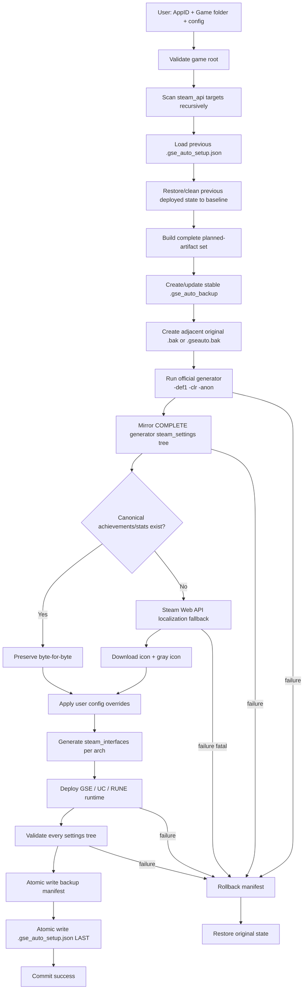
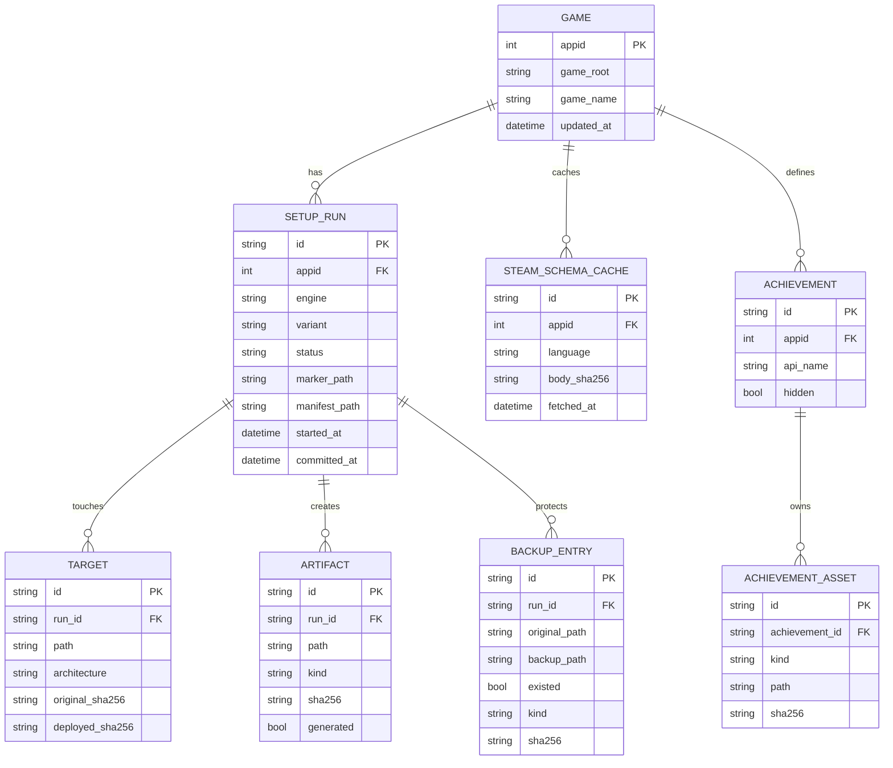

# Port nguyên xi GSE_UC_Setup vào 0xoLemon Launcher: phân tích parity và kế hoạch patch

## Tóm tắt điều hành

Phân tích trực tiếp `steam_settings_1.zip`, `steam_settings-2.zip`, package `GSE_UC_Setup_V1_8_2`, cùng source `src/` và `src-tauri/` hiện tại cho thấy **launcher đã port được khung chức năng, nhưng chưa port đúng contract của tool gốc**. Sai khác nghiêm trọng nhất nằm ở pipeline generator: launcher hiện cưỡng bức `-skip_ach`, chỉ gọi Steam Web API bằng `l=english`, rồi có thể **ghi đè `achievements.json` đầy đủ của official generator bằng bản tiếng Anh rút gọn**; đây phù hợp rất sát với khác biệt thực tế giữa hai ZIP. Backup/restore, Savegame Manager, việc preserve output generator, atomic write và UI sizing cũng chưa đạt parity. Để “bê nguyên xi”, nên coi source Python gốc và `steam_settings_1.zip` là **golden contract**, còn Rust/Tauri chỉ thay runtime/UI host chứ không được tự phát minh lại semantics.

## Đối chiếu hai cây `steam_settings`

### Kết quả tổng thể

Phân tích SHA-256 trực tiếp hai ZIP cho kết quả:

| Thuộc tính | `steam_settings_1.zip` | `steam_settings-2.zip` |
|---|---:|---:|
| Tổng file | **109** | **113** |
| Tổng kích thước uncompressed | **1,725,097 B** | **1,868,584 B** |
| File chung byte-identical | **104** | **104** |
| File chung nhưng khác nội dung | **5** | **5** |
| Chỉ có trong ZIP này | 0 | **4** |
| Achievement | 33 | 33 |
| Achievement artwork | 66 ảnh | 66 ảnh |

Điểm quan trọng: **không phải ZIP 2 “thiếu ảnh”** trong fixture này; cả hai đều có 66 ảnh, tương ứng 33 achievement × icon màu + gray icon. Khác biệt lớn nằm ở **metadata achievement/localization**.

`steam_settings_1.zip/achievements.json` có **49,811 byte**, chứa localization đa ngôn ngữ; achievement đầu tiên có 14 ngôn ngữ, gồm `english`, `brazilian`, `koreana`, `latam`, `spanish`, `russian`, `french`, `dutch`, `german`, `japanese`, `italian`, `portuguese`, `schinese`, `tchinese`. `steam_settings-2.zip/achievements.json` chỉ **10,725 byte** và metadata tôi kiểm tra chỉ còn English, mặc dù `supported_languages.txt` vẫn liệt kê 14 ngôn ngữ. Đây là dấu hiệu rất mạnh của việc canonical generator output đã bị fallback English-only ghi đè sau đó.

### Những file thực sự khác nhau

| File | ZIP 1 | ZIP 2 | Ý nghĩa |
|---|---|---|---|
| `achievements.json` | 49,811 B · `546fa5d2c31dbc1a7ec5e5f8b4bc05ef0196d12b6a99a5b0372e792dfbee6967` | 10,725 B · `b12fb790c36513752cb31aa97d490fc95628a688be8aee7ff595a5e8330675ba` | **Mất localization** |
| `configs.overlay.ini` | 5,175 B · `3c8f7150a3f9c4466cb39152f7c15c991dd30f15b62f70d049bc078390b96ee0` | 5,167 B · `cb5ec89e35dabec867ab560240a69e479686964322e08709d6424058298531e7` | Config overlay đã bị chỉnh |
| `sounds/overlay_achievement_notification.wav` | 259,126 B · `938da00091c50b21c645276a5e5bed6ebfa5bde2c9ab94bd1c17e5ba1b4fd5d1` | 302,674 B · `7db2e0a85e47c75f7b64a4b89040f2a3129e2b5e2d03200d9aebea71d6b6572b` | Asset khác |
| `sounds/overlay_friend_notification.wav` | 175,890 B · `c12de900ea477b645d00da2e463e8e2bc4f35c2042168dd3954bf4b6c6ed9cb6` | 302,674 B · `7db2e0a85e47c75f7b64a4b89040f2a3129e2b5e2d03200d9aebea71d6b6572b` | ZIP 2 dùng cùng WAV với achievement |
| `steam_appid.txt` | 6 B · `52d19b26fb6f59cf5c387cdc31209de1d6f440531107d207966584e8226847d4` | 7 B · `8e7f466891d15744ce2746611293450bfdb4627f2768cf9b7a5622d5e3f2b049` | Cùng AppID `945360`, ZIP 2 thêm newline |

Bốn file chỉ xuất hiện trong ZIP 2 là tài liệu/license:

| File | Bytes | SHA-256 |
|---|---:|---|
| `fonts/README.md` | 116 | `d4d3da923d94a10191ac758c3ca113035626b48b6f85922ee15d53a3a5b39460` |
| `fonts/Roboto-Medium-LICENSE.txt` | 11,560 | `3ddf9be5c28fe27dad143a5dc76eea25222ad1dd68934a047064e56ed2fa40c5` |
| `sounds/LICENSE.md` | 297 | `1a0ae1d6fd26da19fff19609e68f0afe3a798be66edd3e2af45fb74654f5080b` |
| `sounds/README.md` | 275 | `15edd9dae8966f876e34a7101d1cb26909d4aeb2d1d6630451d74337b2dfa6ad` |

Đáng chú ý, **tool gốc cố ý không deploy README/LICENSE** khi materialize `fonts.EXAMPLE` và `sounds.EXAMPLE`; test `test_v181_full_config.py` xác nhận runtime files được copy nhưng `fonts/README.md` và `sounds/LICENSE.md` bị loại. Vì vậy “bê nguyên xi” **không có nghĩa copy mù ZIP 2**: phải copy theo filter của original `materialize_canonical_defaults()` và `merge_settings_tree()`.

### Cây chuẩn

```text
steam_settings/
├─ account_avatar.jpg
├─ account_avatar_default.jpg
├─ achievements.json
├─ branches.json
├─ configs.app.ini
├─ configs.main.ini
├─ configs.overlay.ini
├─ configs.user.ini
├─ depots.txt
├─ emu_version.txt
├─ steam_appid.txt
├─ steam_interfaces.txt
├─ supported_languages.txt
├─ stats.json                         # conditional
├─ inventory.json                     # conditional/generator
├─ controller/
│  ├─ InGameControls.txt
│  ├─ MenuControls.txt
│  └─ glyphs/
│     └─ ... 25 PNG runtime glyphs trong fixture
├─ fonts/
│  └─ Roboto-Medium.ttf
├─ sounds/
│  ├─ overlay_achievement_notification.wav
│  └─ overlay_friend_notification.wav
└─ img/
   ├─ <Steam icon content-hash>.jpg
   ├─ <Steam gray-icon content-hash>.jpg
   └─ ... 66 file cho fixture AppID 945360
```

Bản manifest exhaustive **113 dòng**, chứa **từng path + size + full SHA-256 của cả hai ZIP**, đã được tạo từ hai file upload:

[**Mở phụ lục so sánh đầy đủ `steam_settings_1.zip` ↔ `steam_settings-2.zip`**](sandbox:/mnt/data/zip_compare.md)

Đây nên trở thành **golden fixture** trong repository thay vì chỉ là tài liệu tham khảo.

## Contract thực tế của GSE_UC_Setup gốc

### Generator và `steam_settings`

Nguồn chuẩn là package `GSE_UC_Setup_V1_8_2(20260902-185420).zip`, đặc biệt:

```text
gse_autosetup/core/
├─ installer.py
├─ config_builder.py
├─ official_generator.py
├─ scanner.py
├─ steam_api.py
├─ preserve_loader.py
├─ coldclient.py
├─ uc_online.py
├─ rune.py
├─ steamless.py
├─ steamstub.py
└─ tool_config.py
```

Official generator gốc mặc định xây command:

```text
generate_emu_config.exe -def1 -clr -anon <appid>
```

`-skip_ach` **chỉ được thêm khi caller chủ động yêu cầu `skip_achievements=True`**. Test gốc còn kiểm cụ thể `-def1`, `-anon`, `-clr` phải có và `-cdx`, `-rne`, `-acw` không được tự thêm.

Sau khi generator chạy, original không chọn vài file rồi viết lại theo ý riêng. Nó thực hiện:

```python
merge_settings_tree(generated_settings, settings)
write_basic_settings(
    ...,
    preserve_existing_achievements=generated_has_achievements,
    preserve_existing_stats=generated_has_stats,
)
validate_settings_mirror(generated_settings, settings)
```

Đó chính là contract phải giữ.

**Canonical generator output thắng fallback.** Steam Web API chỉ bổ sung những thứ generator không có; không được ghi đè `achievements.json`/`stats.json` hợp lệ của generator.

### Vì sao launcher hiện tại làm sai

Trong `src-tauri/src/gse_auto_setup.rs` hiện tại, `run_official_generator()` đang gọi:

```rust
.args([
    "-def1",
    "-clr",
    "-anon",
    "-skip_ach", // <-- khác default của tool gốc
    appid_arg.as_str(),
])
```

Trong khi `fetch_steam_schema()` chỉ gọi:

```rust
.query(&[
    ("key", token.as_str()),
    ("appid", app_id_string.as_str()),
    ("l", "english"),
])
```

Sau khi full generated tree được copy vào từng `steam_settings`, launcher lại gọi:

```rust
write_gse_settings(
    resource_root,
    parent,
    cfg,
    schema.as_ref(),
    ...
)?;
```

và writer hiện có thể viết lại `achievements.json`.

**Đây là lỗi parity P0.**

Mẫu thực tế:

```text
Original generator
    ↓
achievements.json 49,811 B
14-language metadata
    ↓
launcher mirror
    ↓
English Web API fallback
    ↓
ghi đè
    ↓
achievements.json 10,725 B
```

Khác biệt ZIP quan sát được phù hợp chính xác với cơ chế này.

### Per-target `steam_settings`

Original `installer.py` xác định:

```python
settings_dirs = {
    target.path.parent / "steam_settings"
    for target in targets
}
```

Do đó game:

```text
Game/
├─ steam_api64.dll
└─ Plugins/
   ├─ x86/
   │  └─ steam_api.dll
   └─ x86_64/
      └─ steam_api64.dll
```

phải sinh:

```text
Game/
├─ steam_settings/
├─ Plugins/
│  ├─ x86/
│  │  ├─ steam_api.dll
│  │  ├─ steam_api.dll.bak
│  │  └─ steam_settings/
│  │     ├─ achievements.json
│  │     ├─ img/
│  │     ├─ configs.main.ini
│  │     └─ ...
│  └─ x86_64/
│     ├─ steam_api64.dll
│     ├─ steam_api64.dll.bak
│     └─ steam_settings/
│        └─ ...
├─ .gse_auto_backup/
└─ .gse_auto_setup.json
```

Đặc biệt, **`Plugins\x86\steam_settings` không phải special case**. Nó tự xuất hiện vì scanner tìm recursive Steam API targets rồi settings tree được materialize bên cạnh **mỗi target**.

Source Rust mới nhất của launcher thực ra đã xây `setting_parents` từ từng `target.parent()`; vì vậy nếu build thực tế vẫn không có `Plugins\x86\steam_settings`, cần xem đó là **setup không đi tới commit, build đang chạy không phải source mới, hoặc branch engine đi sai**, chứ không nên thêm một hack riêng cho `Plugins\x86`.

### Toàn bộ artifact game-level cần hỗ trợ

Với GSE replace mode, contract tối thiểu gồm:

```text
<game>/
├─ .gse_auto_setup.json
├─ .gse_auto_backup/
│  ├─ manifest.json
│  └─ files/
│     └─ <mirror original paths...>
│
├─ **/steam_api.dll
├─ **/steam_api.dll.bak              # preferred adjacent backup
├─ **/steam_api.dll.gseauto.bak      # fallback nếu .bak là file unrelated
├─ **/steam_api64.dll
├─ **/steam_api64.dll.bak
├─ **/steam_api64.dll.gseauto.bak
│
└─ **/steam_settings/
   ├─ configs.main.ini
   ├─ configs.user.ini
   ├─ configs.app.ini
   ├─ configs.overlay.ini
   ├─ achievements.json
   ├─ stats.json                     # nếu có stats
   ├─ branches.json
   ├─ depots.txt
   ├─ supported_languages.txt
   ├─ steam_interfaces.txt
   ├─ steam_appid.txt
   ├─ emu_version.txt
   ├─ inventory.json                 # khi generator tạo
   ├─ account_avatar.jpg
   ├─ account_avatar_default.jpg
   ├─ img/
   │  ├─ <achievement icon>.jpg
   │  └─ <achievement gray icon>.jpg
   ├─ controller/
   │  └─ ...
   ├─ fonts/
   │  └─ Roboto-Medium.ttf
   └─ sounds/
      ├─ overlay_achievement_notification.wav
      └─ overlay_friend_notification.wav
```

`.gse_auto_setup.json` **đã tồn tại trong source Rust hiện tại**: `setup_sync_impl()` ghi marker ở cuối setup. Vì vậy screenshot/runtime trước đây “không sinh marker” có nghĩa setup chưa hoàn tất hoặc binary đang chạy khác source hiện tại; không nên sửa bằng cách tạo marker sớm hơn. Marker phải là **commit record cuối transaction**.

Marker gốc chứa ít nhất:

```json
{
  "version": "...",
  "appid": 945360,
  "backup_manifest": ".../.gse_auto_backup/manifest.json",
  "targets": ["..."],
  "settings_dirs": ["..."],
  "achievements": 33,
  "stats": 0,
  "account_name": "...",
  "save_mode": "gse",
  "custom_save_path": "",
  "overlay_enabled": true,
  "deployment_mode": "replace",
  "adjacent_backups": {
    ".../steam_api.dll": ".../steam_api.dll.bak"
  }
}
```

### Engine-specific artifacts

Original package còn tạo các artifact riêng sau:

| Mode | Artifact chính |
|---|---|
| GSE Preserve | proxy chọn từ `version.dll` / `winhttp.dll` / `dinput8.dll`, proxy `.ini`, `coldloader.asi`, `coldloader.ini`, `gse_steamclient64.dll`, main-EXE `steam_settings/`, marker |
| GSE ColdClient | ColdClient loader, `steamclient*.dll`, `ColdClientLoader.ini`, optional `GameOverlayRenderer*.dll`, optional extra DLL, `steam_settings/` |
| ColdClient Simple | `steamclient.dll`, `steamclient64.dll`, optional `GameOverlayRenderer.dll/64.dll`, đồng thời phải materialize settings ở các Steam API target hợp lệ |
| UC Online2 | replacement `steam_api*.dll`, adjacent backups, selected `plugins/*.dll`, `union-crax.ini` |
| RUNE Regular | replacement Steam API + `steam_emu.ini` cạnh từng target |
| RUNE Steakclient | `winmm.dll`, `steakclient64.dll`, `steak_emu.ini` |
| RUNE Steamclient | `steamclient*.dll`, `rune*.dll`, `GameOverlayRenderer*.dll`, `steam_emu.ini` cạnh target |
| RUNE mọi profile | `steam_appid.txt` ở game root và EXE directory + `.gse_auto_setup.json` |
| RUNE SteamStub helper | `winmm.dll` + `.gse_steamstub.json` |
| Steamless | protected/original executable artifact theo Steamless flow |

### Savegame Manager

Original không chỉ “copy folder”.

`gse_autosetup/save_manager/backup.py` định nghĩa transaction ZIP hoàn chỉnh:

```text
data/
├─ save_backups/
│  └─ <AppID>/
│     ├─ 2026-09-03_12-00-00.zip
│     ├─ 2026-09-03_12-00-00.json
│     └─ safety_2026-09-03_12-10-00.zip
└─ save_manager/
   ├─ metadata.json
   └─ covers/
      └─ ...
```

Bên trong mỗi ZIP:

```text
.gse-save-manifest.json
<AppID>/
└─ <full save tree>
```

Quy trình gốc là:

```text
write .zip.part
→ archive complete
→ ZipFile.testzip()
→ verify .gse-save-manifest.json
→ rename .zip.part → .zip
→ hash SHA-256 archive
→ write sidecar .json
```

Restore còn tạo **safety backup trước khi thay save live**, extract vào `.gse_restore_<appid>_*`, move save cũ sang `.<appid>.restore-old`, rồi mới swap. Nếu restore fail, old folder được đưa trở lại.

Đây là phần Savegame Manager của launcher hiện tại còn thiếu rõ nhất.

## Mapping thiếu hụt sang source launcher

### Backend Rust

File trung tâm hiện tại:

```text
src-tauri/src/gse_auto_setup.rs
```

nên sửa ngay các lỗi P0 sau.

#### Giữ nguyên canonical `achievements.json` và `stats.json`

Hiện tại logic:

```rust
copy_dir(generator_output, &settings_dir)?;
write_gse_settings(...)?;
```

phải đổi thành:

```rust
let generated_achievements =
    generated.as_ref()
        .is_some_and(|root| root.join("achievements.json").is_file());

let generated_stats =
    generated.as_ref()
        .is_some_and(|root| root.join("stats.json").is_file());

write_gse_settings(
    resource_root,
    parent,
    cfg,
    schema.as_ref(),
    localized_schemas.as_ref(),
    generated_achievements,
    generated_stats,
    app,
    logs,
)?;
```

Writer:

```rust
if !preserve_generated_achievements {
    write_fallback_achievements(...)?;
}

if !preserve_generated_stats {
    write_fallback_stats(...)?;
}
```

Tốt hơn nữa:

```rust
fn preserve_canonical_generator_file(
    generated: Option<&Path>,
    file: &str,
) -> bool {
    generated.is_some_and(|p| p.join(file).is_file())
}
```

Và sau mọi override:

```rust
validate_settings_mirror(
    generated_root,
    &settings_dir,
    &[
        "achievements.json",
        "stats.json",
        "branches.json",
        "depots.txt",
        "supported_languages.txt",
        "controller",
        "img",
    ],
)?;
```

Không nhất thiết yêu cầu hash-identical cho bốn `configs.*.ini`, vì original cố ý upsert user-selected settings sau generator. Nhưng các canonical data file không được rewrite nếu generator đã tạo.

#### Bỏ `-skip_ach` khỏi default

Đổi:

```rust
.args(["-def1", "-clr", "-anon", "-skip_ach", appid])
```

thành:

```rust
.args(["-def1", "-clr", "-anon", appid])
```

và nếu muốn giữ fast fallback:

```rust
fn generator_args(appid: u32, skip_achievements: bool) -> Vec<String> {
    let mut args = vec![
        "-def1".into(),
        "-clr".into(),
        "-anon".into(),
    ];

    if skip_achievements {
        args.push("-skip_ach".into());
    }

    args.push(appid.to_string());
    args
}
```

**Parity mode phải mặc định `false`.**

#### Localization Web API đúng contract

Không được chỉ:

```text
l=english
```

Nếu official generator không cung cấp canonical achievement schema, fallback phải tải từng language trong `supported_languages.txt` hoặc language set chuẩn:

```rust
const STEAM_LANGUAGES: &[&str] = &[
    "english",
    "brazilian",
    "koreana",
    "latam",
    "spanish",
    "russian",
    "french",
    "dutch",
    "german",
    "japanese",
    "italian",
    "portuguese",
    "schinese",
    "tchinese",
];
```

Pseudo-code:

```rust
fn fetch_localized_schemas(appid: u32) -> Result<HashMap<String, Value>, Error> {
    let mut out = HashMap::new();

    for language in STEAM_LANGUAGES {
        match fetch_steam_schema_language(appid, language) {
            Ok(schema) => {
                out.insert((*language).to_owned(), schema);
            }
            Err(err) => {
                // log warning; English remains minimum fallback
            }
        }
    }

    Ok(out)
}
```

Merge achievement:

```rust
for base in english_achievements {
    let mut display_name = Map::new();
    let mut description = Map::new();

    for (lang, schema) in localized {
        if let Some(localized_ach) = find_achievement(schema, base.name) {
            display_name.insert(lang.clone(), localized_ach.display_name);
            description.insert(lang.clone(), localized_ach.description);
        }
    }

    // icon + icongray use upstream Steam content-hash filename
}
```

#### Icon + gray icon

Original contract giữ filename content-hash từ URL Steam:

```rust
fn steam_asset_filename(url: &Url, fallback: &str) -> String {
    let leaf = url
        .path_segments()
        .and_then(Iterator::last)
        .unwrap_or_default();

    if looks_like_content_hash_image(leaf) {
        leaf.to_owned()
    } else {
        format!("{fallback}.jpg")
    }
}
```

Với mỗi achievement:

```text
icon
   ↓
steam_settings/img/<hash>.jpg

icongray
   ↓
steam_settings/img/<other-hash>.jpg
```

Nếu có 33 achievement và cả hai URL hợp lệ:

```text
expected artwork count = 66
```

Sau download phải validate:

```rust
if overlay_icons && expected_images > 0 && downloaded_images < expected_images {
    log.warn(...);
}
```

#### Filter runtime docs

`materialize_canonical_defaults()` Rust hiện copy mọi file trong `fonts.EXAMPLE`/`sounds.EXAMPLE`; original không làm vậy.

Thêm:

```rust
fn is_runtime_default_file(path: &Path) -> bool {
    let name = path
        .file_name()
        .and_then(|n| n.to_str())
        .unwrap_or("")
        .to_ascii_lowercase();

    !matches!(
        name.as_str(),
        "readme.md"
            | "readme.txt"
            | "license.md"
            | "license.txt"
            | "changelog.md"
            | "changelog.txt"
    )
}
```

rồi:

```rust
if entry.file_type().is_file() && is_runtime_default_file(entry.path()) {
    copy...
}
```

### Backup và restore

Current `BackupManifest`:

```rust
struct BackupManifest {
    game_root: String,
    entries: Vec<BackupEntry>,
}
```

nên nâng lên tương đương original:

```rust
#[derive(Serialize, Deserialize)]
struct BackupManifest {
    game_root: String,
    created_at: String,
    storage: String, // "game-local"
    entries: Vec<BackupEntry>,
}

#[derive(Serialize, Deserialize)]
struct BackupEntry {
    original: String,
    backup: String,
    existed: bool,
    kind: ArtifactKind,
    sha256: Option<String>,
}
```

Quan trọng hơn: **entry cũ không được overwrite trên rerun**.

```rust
if manifest.entries.iter().any(|e| same_path(&e.original, path)) {
    return Ok(());
}
```

Adjacent backup hiện tại launcher đơn giản làm:

```rust
steam_api64.dll.bak
```

nếu chưa tồn tại.

Phải port nguyên `choose_adjacent_backup_path()`:

```text
preferred = steam_api64.dll.bak

nếu preferred:
    - chưa có → dùng
    - là backup đã được marker cũ quản lý → dùng
    - tồn tại nhưng unrelated → KHÔNG ghi đè

fallback = steam_api64.dll.gseauto.bak

nếu fallback:
    - chưa có → dùng
    - known backup → dùng
    - unrelated → abort an toàn
```

Marker phải lưu chính xác đường dẫn đã chọn.

### `Plugins\x86\steam_settings`

Không cần module riêng. Sửa/giữ scanner + deployment thành invariant test:

```rust
for target in &targets {
    settings_dirs.insert(
        target.path
            .parent()
            .expect("Steam API target has parent")
            .join("steam_settings")
    );
}

for settings_dir in settings_dirs {
    mirror_full_settings_tree(&generated, &settings_dir)?;
}
```

Golden integration fixture:

```text
Game/
├─ Game.exe
├─ steam_api64.dll
└─ Plugins/
   ├─ x86/steam_api.dll
   └─ x86_64/steam_api64.dll
```

assert:

```text
Game/steam_settings/
Plugins/x86/steam_settings/
Plugins/x86_64/steam_settings/
```

đều tồn tại và mỗi tree có:

```text
configs.main.ini
configs.user.ini
configs.app.ini
configs.overlay.ini
steam_interfaces.txt
achievements.json
img/
controller/
```

### Frontend

Hai file cần sửa trực tiếp:

```text
src/components/GseUcStandaloneView.tsx
src/components/GseUcStandaloneView.css
```

UI hiện tại ghi:

```tsx
Setup_Emulator
```

trong khi UI source gốc dùng:

```text
Setup & Emulator
```

Sửa:

```tsx
<button ...>
  Setup & Emulator
</button>
```

CSS hiện đang tự mở content tới gần full-width; source UI gốc dùng workspace khoảng **1240px centered** với outer horizontal space khoảng 30px. Đó là nguyên nhân rõ ràng khiến screenshot launcher có phần GSE lệch về trái/phải so với bố cục mong muốn.

Khung nên là:

```css
.gse-page-header-inner,
.gse-workspace-tabs,
.gse-content,
.gse-footer-actions {
  width: min(1240px, calc(100% - 60px));
  margin-inline: auto;
}

.gse-page {
  min-width: 0;
  width: 100%;
}

.gse-content {
  box-sizing: border-box;
}

.gse-card {
  border-radius: 18px;
}

.gse-inset {
  border-radius: 12px;
}
```

Màu **không bê hardcoded color từ tool Python**, vì bạn đã yêu cầu tuân thủ color wheel:

```css
.gse-page {
  --gse-accent: var(--theme-accent);
  --gse-accent-strong: var(--theme-accent-strong);
}
```

Hiện CSS GSE vẫn còn một số màu modal hardcoded kiểu blue; nên thay toàn bộ bằng theme vars.

### Savegame Manager

Current Rust mới chỉ có:

```text
gse_auto_setup_list_saves
gse_auto_setup_create_snapshot
```

Port exact cần thêm:

```rust
gse_auto_setup_list_backups
gse_auto_setup_create_save_backup
gse_auto_setup_read_save_backup
gse_auto_setup_restore_save_backup
gse_auto_setup_drive_status
gse_auto_setup_connect_drive
gse_auto_setup_disconnect_drive
gse_auto_setup_backup_save_to_drive
gse_auto_setup_list_cloud_backups
gse_auto_setup_restore_cloud_backup
```

Có thể reuse Google Drive infrastructure đã có trong launcher thay vì duplicate OAuth, nhưng **UI/semantics phải tương đương original**.

Khi thêm command, phải đồng bộ:

```text
src-tauri/src/lib.rs
src-tauri/permissions/allow-all.json
```

Tauri v2 yêu cầu command frontend dùng phải được expose qua permissions; official Tauri docs cũng mô tả command permissions được khai báo trong `permissions` directory. citeturn3search10

Build hiện tại của project đã có custom gate:

```json
"build": "npm run check:tauri-acl && npm run check:web-security && tsc -b && vite build"
```

nên ACL mismatch sẽ dừng build trước TypeScript/Vite. fileciteturn0file1

## Execution model, Activity log và Steam Web API

### Công việc phải chạy ngoài main thread

Tauri khuyến nghị async command cho heavy work vì command synchronous mặc định chạy trên main thread; `spawn_blocking` dùng executor chuyên cho blocking operations. citeturn3search0turn3search2

Những thao tác sau **không được chạy trực tiếp trên UI/main thread**:

| Task | Kiểu |
|---|---|
| Recursive scan game folder | blocking filesystem |
| PE architecture inspection | blocking I/O + CPU |
| SHA-256 file/tree | CPU + I/O |
| `.gse_auto_backup` recursive copy | blocking I/O |
| Generator child process | process + blocking stream |
| Steamless | CPU/process/filesystem |
| GSE/UC/RUNE deployment | filesystem |
| Full settings mirror | filesystem |
| Achievement artwork downloads nếu dùng blocking client | network blocking |
| ZIP save backup | CPU compression + I/O |
| ZIP integrity check | CPU + I/O |
| Save restore | filesystem |
| Recursive directory size | filesystem |
| Restore/rollback | filesystem |

Pattern:

```rust
#[tauri::command]
async fn gse_auto_setup_run(
    app: tauri::AppHandle,
    config: GseAutoSetupConfig,
) -> Result<GseAutoSetupResult, String> {
    tauri::async_runtime::spawn_blocking(move || {
        setup_sync(app, config)
    })
    .await
    .map_err(|e| format!("setup worker failed: {e}"))?
}
```

Current source đã làm đúng pattern này cho `run` và `restore`; nên giữ.

### Generator không được bật CMD

Current helper:

```rust
fn hidden_child_command(program: &Path) -> Command {
    let mut command = Command::new(program);

    #[cfg(windows)]
    {
        use std::os::windows::process::CommandExt;

        const CREATE_NO_WINDOW: u32 = 0x0800_0000;
        command.creation_flags(CREATE_NO_WINDOW);
    }

    command
}
```

là đúng hướng. Rust `CommandExt::creation_flags()` chuyển flags xuống `CreateProcess`; `CREATE_NO_WINDOW` vì vậy là cách phù hợp để child console không bật cửa sổ CMD. citeturn3search6

Nhưng code hiện tại có một lỗi process-I/O khác:

```rust
.stdout(Stdio::piped())
.stderr(Stdio::piped())
```

sau đó **chỉ đọc stdout**.

Nếu child ghi nhiều stderr, pipe có thể đầy và child bị block. Original Python tránh vấn đề bằng:

```python
stderr=subprocess.STDOUT
```

Port parity tốt nhất:

```rust
let mut child = hidden_child_command(&exe)
    .args(args)
    .stdin(Stdio::null())
    .stdout(Stdio::piped())
    .stderr(Stdio::piped())
    .spawn()?;

spawn_reader("stdout", child.stdout.take(), tx.clone());
spawn_reader("stderr", child.stderr.take(), tx.clone());
```

hoặc merge hai stream bằng process API phù hợp.

### Streaming Activity log

Current event:

```text
gse-auto-setup://progress
```

dùng được với lượng log nhỏ. Nhưng Tauri khuyến nghị **Channels** cho ordered/high-throughput streaming, và chính tài liệu dùng child-process output làm ví dụ điển hình. citeturn3search7turn3search0

Backend:

```rust
#[derive(Clone, serde::Serialize)]
#[serde(tag = "type", content = "data")]
enum GseActivity {
    Progress { percent: u8, message: String },
    Stdout(String),
    Stderr(String),
    Completed,
}

#[tauri::command]
async fn gse_auto_setup_run(
    config: GseAutoSetupConfig,
    activity: tauri::ipc::Channel<GseActivity>,
) -> Result<GseAutoSetupResult, String> {
    tauri::async_runtime::spawn_blocking(move || {
        setup_sync(config, |event| {
            let _ = activity.send(event);
        })
    })
    .await
    .map_err(|e| e.to_string())?
}
```

Frontend:

```tsx
import { Channel, invoke } from '@tauri-apps/api/core'

const channel = new Channel<GseActivity>()

channel.onmessage = (event) => {
  switch (event.type) {
    case 'Stdout':
    case 'Stderr':
      setLogs((old) => [...old, event.data])
      break
    case 'Progress':
      setProgress(event.data.percent)
      setProgressText(event.data.message)
      break
  }
}

await invoke('gse_auto_setup_run', {
  config,
  activity: channel,
})
```

### Hardcoded Steam Web API key

Source Rust hiện đã dùng đúng method bạn yêu cầu về mặt obfuscation:

```rust
fn backend_steam_token() -> String {
    const MASK: u8 = 0x5A;

    const DATA: [u8; 32] = [
        25, 98, 105, 98, 99, 27, 108, 27,
        31, 104, 110, 99, 110, 108, 108, 30,
        106, 27, 111, 104, 105, 110, 30, 25,
        99, 30, 104, 30, 104, 105, 25, 108,
    ];

    DATA.iter()
        .map(|byte| char::from(*byte ^ MASK))
        .collect()
}
```

Tức:

```text
cipher_byte = plaintext_byte XOR 0x5A
plaintext_byte = cipher_byte XOR 0x5A
```

Credential chỉ nằm tại:

```text
src-tauri/src/gse_auto_setup.rs
```

và frontend chỉ gọi command; **không được trả key qua IPC, props, Activity log, error string hay DevTools**.

Nên refactor thành:

```rust
mod steam_credentials {
    pub(super) fn web_api_key() -> String {
        const MASK: u8 = 0x5A;
        const DATA: [u8; 32] = [/* encoded bytes */];

        DATA.iter()
            .map(|b| char::from(*b ^ MASK))
            .collect()
    }
}
```

Usage:

```rust
let key = steam_credentials::web_api_key();

client
    .get(STEAM_SCHEMA_ENDPOINT)
    .query(&[
        ("key", key.as_str()),
        ("appid", appid.as_str()),
        ("l", language),
    ])
    .send()?;

drop(key);
```

Test nên kiểm:

```rust
assert_eq!(backend_steam_token().len(), 32);
```

và hash expected thay vì đặt plaintext key vào test:

```rust
assert_eq!(
    sha256(backend_steam_token().as_bytes()),
    EXPECTED_KEY_SHA256
);
```

Sau build:

```text
scan src/
scan dist/
scan target/release/
scan installer
```

để chắc plaintext không vô tình xuất hiện.

Tuy nhiên cần gọi đúng tên: **XOR byte-array là obfuscation, không phải encryption bảo mật**. Vì cả dữ liệu và thuật toán giải mã đều ship trong desktop executable, attacker đủ quyết tâm vẫn có thể reconstruct hoặc bắt key trong memory. OWASP xác định API keys/secrets hardcoded trong app package có thể bị recover; obfuscation chỉ tăng effort, không ngăn extraction. citeturn4search0

Nếu key bắt buộc phải ship theo yêu cầu sản phẩm, giảm rủi ro bằng cách:

```text
backend-only
+ không log
+ không frontend IPC
+ minimum API permission
+ request rate limits
+ secret scanner
+ assemble only when needed
```

OWASP cũng khuyến nghị nếu buộc hardcode thì hạn chế permission/restriction của credential, và coi obfuscation là biện pháp hardening cuối cùng chứ không phải kho bí mật. citeturn4search0turn4search8

## Backup, rollback và semantics rerun

### Transaction đúng theo original



### Stable baseline

Đây là điểm rất quan trọng của original:

```text
run 1:
original Steam DLL
   ↓ snapshot
.gse_auto_backup = ORIGINAL

run 2:
không snapshot emulator DLL hiện tại làm "original" mới
   ↓
restore baseline ORIGINAL
   ↓
deploy config mới

run N:
baseline vẫn là ORIGINAL đầu tiên
```

`backup_one()` vì vậy không được overwrite existing manifest entry.

### Atomic writes

Current launcher đang có nhiều đoạn:

```rust
fs::write(...)
```

cho manifest/marker/settings.

Nên có một helper duy nhất:

```rust
fn atomic_write(path: &Path, bytes: &[u8]) -> Result<(), String> {
    let parent = path.parent()
        .ok_or("destination has no parent")?;

    fs::create_dir_all(parent)
        .map_err(|e| e.to_string())?;

    let tmp = parent.join(format!(
        ".{}.gse-tmp",
        path.file_name()
            .and_then(|x| x.to_str())
            .unwrap_or("state")
    ));

    {
        let mut f = fs::File::create(&tmp)
            .map_err(|e| e.to_string())?;

        f.write_all(bytes)
            .map_err(|e| e.to_string())?;

        f.sync_all()
            .map_err(|e| e.to_string())?;
    }

    // production Windows implementation nên dùng replace semantics
    // thích hợp khi destination đã tồn tại.
    replace_file(&tmp, path)?;

    Ok(())
}
```

Dùng cho:

```text
.gse_auto_backup/manifest.json
.gse_auto_setup.json
saved launcher config
sidecar save-backup metadata
```

Marker phải ghi **cuối cùng**. Có marker nghĩa là transaction setup đã commit.

### Restore exact

Current `gse_auto_setup_restore()` chỉ reverse manifest entries; nó chưa đạt cleanup semantics gốc.

Restore chuẩn:

```text
read .gse_auto_setup.json
   ↓
resolve exact manifest
   ↓
reverse all manifest entries
   ↓
path originally existed?
   yes → restore baseline
   no  → delete deployed path
   ↓
remove ONLY adjacent backups recorded by marker
   ↓
remove .gse_auto_setup.json
   ↓
remove .gse_auto_backup
   ↓
clean transaction temp
```

Không được xóa arbitrary `*.bak`; chỉ xóa file mà marker xác nhận tool tạo.

Pseudo-code:

```rust
fn restore_latest(game_root: &Path) -> Result<()> {
    let marker = load_marker(game_root)?;
    let manifest = load_manifest(&marker.backup_manifest)?;

    restore_manifest(&manifest)?;

    for backup in marker.adjacent_backups.values() {
        remove_known_managed_backup(backup)?;
    }

    remove_if_exists(game_root.join(".gse_auto_setup.json"))?;
    remove_dir_if_exists(game_root.join(".gse_auto_backup"))?;

    Ok(())
}
```

Nếu marker mất nhưng:

```text
.gse_auto_backup/manifest.json
```

còn tồn tại, original có fallback restore từ manifest.

### DB cache/manifest đề xuất

Để port **exact**, `.gse_auto_setup.json` và `.gse_auto_backup/manifest.json` vẫn là canonical filesystem artifacts. SQLite dưới đây chỉ nên là launcher cache/index bổ sung, không thay semantics gốc.



## Patch ưu tiên và regression gates

### Danh sách patch

| Priority | File | Thay đổi | LOC ước tính | Risk |
|---|---|---|---:|---|
| **P0** | `src-tauri/src/gse_auto_setup.rs` | Bỏ default `-skip_ach`; preserve generated achievement/stats; multi-language fallback; filter docs; validate full mirror | 250–400 | Cao |
| **P0** | `src-tauri/src/gse_auto_setup.rs` | Port `choose_adjacent_backup_path`, first-baseline manifest semantics, hash metadata, restore cleanup | 180–280 | Cao |
| **P0** | `src-tauri/src/gse_auto_setup.rs` | Đọc cả stdout/stderr generator, timeout/kill tree, no-console | 80–130 | Trung bình |
| **P0** | `src/components/GseUcStandaloneView.tsx` | Port controls/labels/workflow original; `Setup & Emulator`; full Savegame UI | 180–320 | Trung bình |
| **P0** | `src/components/GseUcStandaloneView.css` | 1240px centered layout; spacing/radius parity; color-wheel vars | 120–200 | Thấp |
| **P1** | `src-tauri/src/gse_auto_setup_save.rs` mới | Exact ZIP backup, manifest, hash, safety backup, transactional restore | 250–350 | Trung bình |
| **P1** | `src-tauri/src/gse_auto_setup_steam.rs` mới | Key reconstruction + per-language Web API + image downloader | 180–260 | Trung bình |
| **P1** | `src-tauri/src/gse_auto_setup_backup.rs` mới | Manifest, atomic write, rollback/rerun | 220–300 | Cao |
| **P1** | `src-tauri/src/lib.rs` | Register Save Manager/parity commands | 15–30 | Thấp |
| **P1** | `src-tauri/permissions/allow-all.json` | ACL cho command mới | 10–20 | Thấp |
| **P1** | `src/lib/helpRegistry.ts` | Tạo `gseUcSetup` help topic thay vì map tạm sang Settings | 5–15 | Thấp |
| **P1** | i18n help files | Nội dung help GSE riêng | 30–60 | Thấp |
| **P2** | `src-tauri/src/gse_auto_setup_contract_test.rs` hoặc tests riêng | Golden-tree, rollback, rerun, localized schema | 300–500 | Thấp |
| **P2** | `src/components/GseUcStandalone.contract.test.mjs` | UI/command/label contracts | 100–180 | Thấp |

Về lâu dài, `gse_auto_setup.rs` đã hơn một nghìn dòng; nên chia gần với module boundary của original:

```text
src-tauri/src/gse_auto_setup/
├─ mod.rs
├─ scanner.rs
├─ generator.rs
├─ settings.rs
├─ steam_web_api.rs
├─ backup.rs
├─ gse.rs
├─ uc.rs
├─ rune.rs
└─ save_manager.rs
```

Điều này không bắt buộc cho parity, nhưng giảm đáng kể khả năng một sửa chữa achievement làm hỏng restore hoặc UC.

### Golden tests bắt buộc

**Golden tree test** phải chạy official fixture rồi so cây:

```text
expected/
└─ steam_settings/

actual/
└─ steam_settings/
```

Assert:

```text
path set equal
required runtime file set equal
canonical generated file hashes equal
achievement count equal
localization language set equal
icon references resolve
gray-icon references resolve
```

Với fixture hiện tại:

```text
33 achievements
66 image files
14 supported languages
```

và `achievements.json` của canonical generator không được thay byte khi preserve mode được kích hoạt.

**Nested API test:**

```text
Game/
├─ steam_api64.dll
└─ Plugins/
   ├─ x86/steam_api.dll
   └─ x86_64/steam_api64.dll
```

assert ba settings tree được sinh.

**Backup collision test:**

```text
steam_api64.dll.bak = unrelated user file
```

assert:

```text
.bak untouched
.gseauto.bak created
```

**Rerun test:**

```text
original hash = A
setup 1 → emulator hash = B
setup 2 → emulator hash = C
restore → hash MUST equal A
```

Không được equal B.

**Failure-injection test:**

```text
backup done
generator done
first DLL replaced
throw simulated error
```

sau exception:

```text
all originals restored
no committed marker
baseline backup valid
```

**Achievement preservation:**

```rust
let before = fs::read("generated/achievements.json")?;
setup(...)?;
let after = fs::read("installed/steam_settings/achievements.json")?;

assert_eq!(before, after);
```

khi official generator đã cung cấp file.

**Image completeness:**

```text
for every achievement:
 icon     → file exists
 icon_gray → file exists
```

**Save Manager tests:**

```text
.zip.part never remains after success
ZIP test passes
.gse-save-manifest.json exists
sidecar SHA-256 equals actual ZIP
path traversal member rejected
wrong AppID restore rejected
restore creates safety_* backup
simulated restore failure restores old live folder
```

### Contract checks của launcher

Project đã đặt `check:tauri-acl` trước TypeScript/Vite trong build pipeline. fileciteturn0file1 Giữ gate này và thêm test đối chiếu ba nguồn:

```text
frontend invoke("...")
        =
src-tauri generate_handler![...]
        =
permissions/allow-all.json
```

Tauri cũng yêu cầu expose commands trong permission configuration, nên đây là regression gate đúng với security model framework. citeturn3search10

`helpRegistry` phải có mapping cho **mọi `TabId`**. Source hiện tại đã có:

```ts
'GSE / UC Setup': 'settings',
```

nên build không còn TS2741; nhưng parity UX tốt hơn là:

```ts
export type HelpTopicId =
  | ...
  | 'gseUcSetup'

export const HELP_TOPIC_BY_TAB: Record<TabId, HelpTopicId> = {
  ...
  'GSE / UC Setup': 'gseUcSetup',
}
```

TypeScript config của project bật cả `noUnusedLocals` và `noUnusedParameters`, nên module mới phải sạch unused imports/parameters trước khi build. fileciteturn0file0

Pipeline CI tối thiểu nên là:

```text
cargo fmt --check
cargo check
cargo test

npm run check:tauri-acl
npm run check:web-security
npm run lint
tsc -b
vite build

golden GSE tree parity test
nested Plugins/x86 parity test
backup/rerun/rollback tests
secret plaintext scan
```

**Definition of Done cho “bê nguyên xi”** không nên là “Setup báo Success”. Nó phải là:

```text
Original package
        │
        │ same AppID + same options + same resource version
        ▼
golden filesystem contract
        ▲
        │
0xoLemon Rust integration
```

với khác biệt duy nhất được chủ động chấp nhận là **UI dùng color wheel của 0xoLemon và Steam Web API credential không xuất hiện trong UI**. Mọi semantics còn lại—generator arguments, recursive target discovery, `Plugins\x86\steam_settings`, full settings mirror, localized achievements, icon/gray icon, backup baseline, `.gse_auto_setup.json`, `.gse_auto_backup`, adjacent backups, rollback, rerun, Savegame ZIP/manifest/safety restore—nên được xem là contract bắt buộc của tool gốc, không phải tính năng “nice-to-have”.